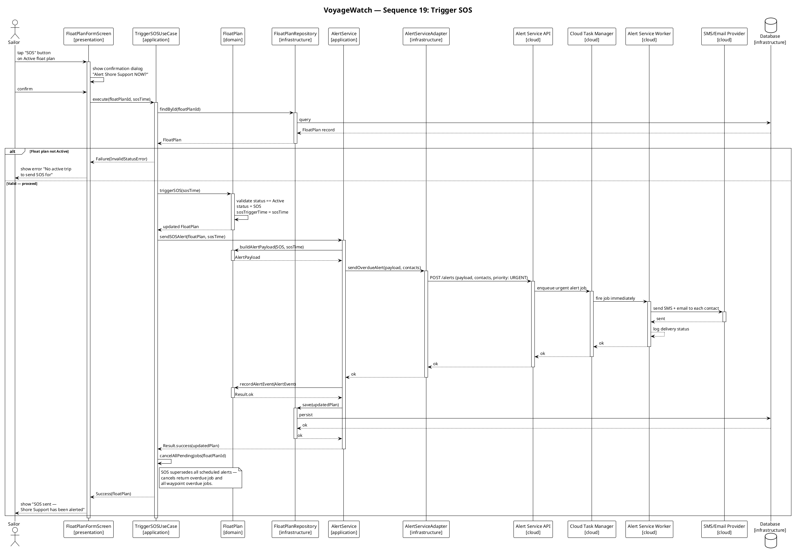

# Generate Sequence

A skill that transforms behavioral specifications (use cases, activity diagrams) and structural specifications (component diagrams) into PlantUML sequence diagrams. It proposes participants interactively, generates diagrams following consistent conventions, and validates the output against all source artifacts.

The skill is project-agnostic. It works with any four-layer architecture (or similar layered structure) and adapts to the conventions already present in the target project.

## Pre-flight

Run before Phase 1. Abort if required inputs are missing.

**Step 1. Resolve input paths.**

Check the user's invocation for explicit paths. If the user provided paths for any input type, use those. Otherwise, scan the project:

| Input | Scan patterns | Required |
|-------|--------------|----------|
| Use case spec | `**/use_cases.md`, `**/use_case*.md`, `**/use-cases*.md` | Yes |
| Activity diagrams | `**/*_Activity.puml`, `**/*Activity*.puml`, `**/activity*/**/*.puml` | Yes |
| Component diagram | `**/components/**/*.puml`, `**/architecture*.puml`, `**/component*.puml` | Yes |
| Existing sequences | `**/sequences/**/*.puml` | No (style reference) |
| Domain model | `**/domain_model.puml`, `**/domain/**/*.puml` | No (supplementary) |

**Step 2. Validate existence.**

For each required input, confirm the file exists and is non-empty. If any required input is missing, **stop and report** what is missing. Do not proceed with partial inputs.

**Step 3. Identify target use cases.**

Parse the use case spec to extract all use case identifiers (e.g., `UC-1.1`, `UC-2.4`). Match each UC to its activity diagram by UC number. Report:

- UCs with all three inputs ready → eligible
- UCs missing an activity diagram → **excluded** (report to user, do not infer)
- UCs the user explicitly excluded → skipped

If the user specified UCs in the invocation (e.g., `generate sequence for UC-2.4`), filter to only those UCs. If the user specified a package (e.g., `Package 2: Trip Execution`), filter to UCs in that package. If neither, target all eligible UCs.

**Step 4. Validate input completeness.**

For each eligible UC, run a content-sufficiency audit on its three inputs before proceeding. This is the validate-first gate — it catches incomplete inputs before generation starts, not mid-generation.

For each UC, check:

| Check | What to verify | Fail condition |
|---|---|---|
| **Spec fields** | Use case spec contains actor, goal, precondition, main flow (≥2 steps), postcondition | Any required field missing or empty |
| **Activity coverage** | Activity diagram action nodes cover ≥75% of spec main flow steps | Coverage ratio below 0.75 |
| **Branch presence** | Activity diagram has at least one conditional (`if`, `switch`, `repeat`) if the spec has alternate flows | Spec has alternate flow but activity has no branches |
| **Component mappability** | Every "System does X" activity node can be plausibly mapped to a class in the component diagram | Any system step has no plausible owner |

**Step 4a. Apply completeness checklist (if available).**

Load the reusable checklist from the doc-consistency skill directory:

```
~/.agents/skills/doc-consistency/checklist.md
```

If the checklist exists, apply each applicable rule to the UC's spec and activity diagram. Skip rules where the UC has no relevant surface area.

Append checklist findings to the rejection payload:

```
UC-2.4 TriggerSOS — REJECTED
  Spec fields:    ✓ Complete
  Activity coverage: ✗ 4/8 steps (50% — below 75% threshold)
    Missing: step 3 "System records SOS trigger time"
    Missing: step 5 "System cancels all pending scheduled alert jobs"
  Branch presence:  ✓ Present
  Component mapping: ✗ 1 unmappable step
    "Cloud Services logs all events to Cloud Database"
    → No class in component diagram matches this action
  Checklist:
    ✗ SD-1: Main flow step "System validates status" has no alternate flow for failure
    ✗ IU-4: UC triggers CancelSOS but has no alternate flow for CancelSOS failure
```

If the checklist does not exist, skip this step silently (do not error).

**On failure:** Do not generate. Emit a structured rejection payload:

```
UC-2.4 TriggerSOS — REJECTED
  Spec fields:    ✓ Complete
  Activity coverage: ✗ 4/8 steps (50% — below 75% threshold)
    Missing: step 3 "System records SOS trigger time"
    Missing: step 5 "System cancels all pending scheduled alert jobs"
  Branch presence:  ✓ Present
  Component mapping: ✗ 1 unmappable step
    "Cloud Services logs all events to Cloud Database"
    → No class in component diagram matches this action
```

**On success:** Log the pass and proceed to Step 5.

In batch mode, run the audit for all eligible UCs first. Present a summary table:

```
Input Completeness Audit:
  UC-1.1  Create Float Plan        ✓ Pass (6/6 spec fields, 8/8 activity steps)
  UC-1.2  Edit Float Plan          ✓ Pass (6/6 spec fields, 5/5 activity steps)
  UC-2.4  Trigger SOS              ✗ Fail (activity coverage 50%)
  UC-2.5  Cancel SOS               ✓ Pass (6/6 spec fields, 4/4 activity steps)
  ...
```

The user can then choose to: (a) fix the failing inputs and re-run, (b) skip failing UCs and generate only passing ones, or (c) override and generate anyway (accepting degraded quality).

**Step 5. Load style reference.**

If existing sequence diagrams are present, read 2-3 of them. Extract the project's conventions:
- Participant alias patterns
- Message phrasing style
- Activation/deactivation rhythm
- Alt/else formatting
- Title format
- Note usage

Store these as the **style reference** for generation. If no existing sequences exist, default to the conventions in the Conventions section below.

## The Loop

Five sequential phases. In batch mode, some phases are parallelized (see Batch Mode).

### Phase 1 — Discover Inputs

For each eligible UC, extract structured information from all three inputs.

**From the use case spec:**
- UC identifier and name
- Primary actor and secondary actors (if any)
- Goal (one sentence)
- Precondition
- Main flow (numbered steps)
- Alternate flow (if any)
- Postcondition
- Inter-UC relationships (dependencies, extends, triggers)

**From the activity diagram:**

Parse the PlantUML activity syntax into a linear step list. Classify each node:

| Activity node | Classification | Sequence mapping |
|---------------|---------------|------------------|
| `:Actor does X;` | User action | Message from actor to screen |
| `:System does Y;` | System action | Message to inferred responsible class |
| `if (condition?)` / `else` / `endif` | Branch | `alt` / `else` / `end` block |
| `fork` / `fork again` / `end fork` | Parallel flow | Parallel `activate` blocks or concurrency note |
| `repeat` / `repeat while` | Loop | `loop` block |
| `switch` / `case` / `endswitch` | Multi-way branch | Nested `alt` / `else` blocks |
| `start` / `stop` | Flow boundaries | Diagram entry/exit |
| `note` | Contextual note | `note right of` or `note over` |

Produce a **step list** — an ordered array of classified steps with their source line numbers from the activity diagram. This is the input to Phase 3.

**From the component diagram:**

Extract a **class inventory** — an array of objects, each with:
- Class name
- Layer (the `[layer]` tag or inferred from package structure)
- Available methods/signatures (if visible in the diagram)
- Dependency arrows (who this class calls, who calls this class)

**Also extract cloud services.** If the component diagram contains a cloud services or external services package, extract:
- Each cloud service name
- The dependency chain between cloud services (e.g., `AlertServiceAPI → CloudTaskManager → AlertWorker → SMS/EmailProvider`)
- Which infrastructure adapter in the local app connects to which cloud service entry point

This cloud flow is part of the sequence — do not abstract it behind a note. If the component diagram shows distinct cloud components with arrows between them, the sequence diagram must show them as participants with explicit messages.

This inventory is used in Phase 2 for participant proposals and in Phase 3 for responsibility mapping.

**From existing sequence diagrams (style reference):**

Extract:
- How participants are aliased (e.g., `UseCase`, `Repo`, `DB`)
- How messages are phrased (verb style, parameter style)
- How returns are formatted (`ok`, `Success(...)`, `Failure(...)`)
- Title format and numbering scheme
- When notes are used

### Phase 2 — Propose Participants (Interactive)

This phase requires user approval before proceeding. Do not skip it.

**Step 1. Map responsibilities.**

For each classified step from Phase 1, determine which class from the component diagram is responsible:

1. User actions (actor → screen) are straightforward — map to the actor and the relevant screen.
2. System actions ("System validates", "System persists") require looking up which class in the component diagram owns that responsibility. Use these heuristics:
   - "validates", "creates", "orchestrates" → application-layer use case or service
   - "persists", "saves", "stores" → repository (infrastructure)
   - "sends", "dispatches", "notifies" → notification or alert service
   - "shows", "displays", "renders" → presentation screen
   - Domain logic (status transition, invariant check) → domain entity
3. If a step could map to multiple classes, flag it for user resolution.
4. **Cloud service mapping:** When an infrastructure adapter is called (e.g., `AlertServiceAdapter`), trace the dependency arrows in the component diagram to determine the downstream cloud flow. Each cloud service in the chain becomes a participant. Do not collapse the cloud flow into a single note — show each hop as an explicit message.

**Step 2. Build participant table.**

For each UC, produce a table:

```
| Alias | Class | Layer | Role in this UC |
|-------|-------|-------|-----------------|
| Sailor | (actor) | — | Primary actor |
| Screen | SOSScreen | presentation | Shows confirmation dialog |
| UseCase | TriggerSOSUseCase | application | Orchestrates SOS flow |
| ... | ... | ... | ... |
```

Rules for the table:
- The actor gets no layer tag and no `[]` brackets.
- Participant aliases should be short, consistent, and match the project's existing style (from the style reference) if available.
- Each participant must have a clear role description specific to this UC.
- Only include participants that are actually invoked in this UC's flow. Do not include every class in the component diagram.

**Step 3. Present and wait.**

Present the table to the user with the UC name and ask for approval. Support three responses:

- **Approve (y/yes):** Proceed to Phase 3.
- **Edit:** The user modifies the table (add, remove, reorder participants). Apply changes and re-present.
- **Skip:** Mark this UC as skipped, continue to next UC.

In batch mode, present all participant tables at once and accept bulk approval or per-UC edits.

### Phase 3 — Generate Sequence Diagram

Using the approved participants and the classified step list, generate the PlantUML sequence diagram.

**Step 1. Emit header.**


The sequence number (NN) is a sequential index across all diagrams in the project, not the UC number. If existing sequences exist, continue their numbering. If generating fresh, start at 01.

**Step 2. Emit participants.**

In the order they first appear in the flow. Use the aliases and classes from the approved table:

```plantuml
actor "Sailor" as Sailor
participant "SOSScreen\n[presentation]" as Screen
participant "TriggerSOSUseCase\n[application]" as UseCase
...
database "Database\n[infrastructure]" as DB
```

Shape keywords:
| Participant type | PlantUML keyword |
|-----------------|-----------------|
| Human actor | `actor` |
| Application/domain class | `participant` |
| Database / persistent store | `database` |
| Message queue / async channel | `queue` |
| External API / service | `participant` (append `( Service )` for visual distinction) |
| Cloud service | `participant` with layer tag `[cloud]` |

**Step 3. Emit the flow.**

Walk through the classified step list and emit messages. Apply the translation rules from the Conventions section. Key principles:

- Every user action becomes a message from the actor to the screen.
- Every system action becomes a message chain from screen → use case → responsible class → downstream dependencies.
- Every branch becomes an `alt` / `else` block. Error conditions first, happy path last (`else Valid — proceed`).
- Every call gets a return message.
- Use concise method names — `execute(floatPlanId)`, `save(entity)`, `findById(id)`. Do not emit full parameter lists. If the component diagram shows a method signature, use just the method name.
- Use `\n` for line breaks in long messages.
- Pair every `activate` with a `deactivate` before the next message from that lifeline.
- Self-calls (`Participant -> Participant`) do not get separate activation.
- Domain entities are passive — they receive commands and return results, never initiate calls.

**Step 4. Emit footer notes (if applicable).**

If the UC has postconditions that affect other UCs, or terminal states that need context, add a `note over` at the end:

```plantuml
note over Screen
  SOS status is terminal for monitoring purposes.
  The Sailor can still End the float plan (UC-2.3)
  once safe.
end note
```

Close with `@enduml`.

**Step 5. Write to file.**

Write the generated diagram to:

```
docs/uml/sequences/UC-X.Y_FeatureName.puml
```

If the directory does not exist, create it. If the file already exists, ask the user whether to overwrite, skip, or save as `UC-X.Y_FeatureName_v2.puml`.

### Phase 4 — Validate

After generation, run six automated checks. Report results to the user before writing the file (or after, if the user prefers to review first).

**Check 1: Activity coverage.**

Compare every action node from the activity diagram step list against the emitted messages. Every step must have at least one corresponding message. Report any missing steps:

```
⚠ Activity step 4 ("System cancels pending jobs") has no
  corresponding message in the sequence diagram.
```

**Check 2: Component existence.**

Every participant class in the generated diagram must exist in the component diagram inventory. No invented classes:

```
✓ All 9 participants exist in the component diagram.
```

or:

```
⚠ Participant "JobScheduler" does not appear in the component
  diagram. Did you mean "NotificationScheduler"?
```

**Check 3: Layer dependencies.**

No message arrow may cross a forbidden layer boundary:

| From | Allowed To |
|------|-----------|
| `presentation` | `application` |
| `application` | `domain`, `infrastructure` |
| `infrastructure` | `domain`, `cloud` |
| `domain` | (nothing) |
| `cloud` | `cloud` (internal chain only) |

Actor interactions are exempt (actor → screen is always valid).

Report violations with the correct path:

```
⚠ Layer violation: presentation → infrastructure (Screen → DB)
  Correct path: Screen → UseCase → Repo → DB
```

**Check 4: Activation discipline.**

Every `activate` must have a matching `deactivate` before the next message from the same lifeline. Report unpaired activations.

**Check 5: Alt/else structure.**

Every `alt` must have at least one `else` and close with `end`. Error branches must precede the happy path branch labeled `else Valid — proceed` (or equivalent).

**Check 6: Return values.**

Every request message (solid arrow `->`) must have a corresponding return message (dashed arrow `-->`). The return should be one of:
- `ok` for void operations
- An entity name for queries
- `Success(...)` or `Failure(ErrorType)` for result types

Present a summary:

```
UC-2.4 Validation Results:
  ✓ 7/7 activity steps covered
  ✓ 9/9 participants in component diagram
  ✓ Layer dependencies clean
  ✓ Activation pairs balanced
  ✓ Alt/else structure correct
  ✓ All calls have returns
```

If there are warnings, present them and ask the user to approve fixes before writing.

### Phase 5 — Write Output

Write the validated diagram to `docs/uml/sequences/UC-X.Y_FeatureName.puml`.

Confirm to the user:
- File path
- Participant count
- Message count
- Any notes or caveats from validation

If batch mode, write all files and present a summary table:

```
Generated 5 sequence diagrams:
  UC-2.1_StartFloatPlan.puml       — 8 participants, 14 messages
  UC-2.2_CheckInAtWaypoint.puml    — 6 participants, 10 messages
  UC-2.3_EndFloatPlan.puml         — 7 participants, 12 messages
  UC-2.4_TriggerSOS.puml           — 9 participants, 18 messages
  UC-2.5_CancelSOS.puml            — 7 participants, 11 messages
```

### Phase 6 — Adversarial Attack (optional, on demand)

After generation, run ADHD divergent thinking to find assumptions the
diagram makes that the spec never stated. This catches the most dangerous
class of generation errors: plausible-looking diagrams that silently
invent behavior.

**Trigger:** User requests `--attack` flag, or user says "attack the
diagram", "find assumptions", or "what did the generator invent?"

**Cost:** ~10 agent calls per diagram. Not run by default.

**Process:**

1. Collect the three inputs (use case spec, activity diagram, component
   diagram) and the generated sequence diagram.
2. Run ADHD with this prompt:

   > You are attacking a generated sequence diagram. Your job is to find
   > assumptions the diagram makes that the source specs never stated.
   >
   > Use case spec: [paste spec]
   > Activity diagram: [paste activity diagram]
   > Generated sequence: [paste sequence diagram]
   >
   > Generate 6 assumptions the diagram makes that are NOT explicitly
   > stated in the spec or activity diagram. Each assumption is one
   > sentence. Focus on: invented method names, assumed error handling,
   > assumed return types, assumed participant ordering, assumed activation
   > boundaries, and assumed data flow between participants.

3. Collect findings, deduplicate, and present:

```
Adversarial Attack Results — UC-2.4 TriggerSOS:

  ASSUMPTION                                      CONFIDENCE
  ─────────────────────────────────────────────── ──────────
  Diagram assumes FloatPlan.triggerSOS() returns   8/10
  updated FloatPlan, but spec says nothing about
  return type.

  Diagram assumes AlertService.recordAlertEvent()  7/10
  is synchronous, but spec does not specify timing.

  Diagram assumes cancellation of pending jobs is   6/10
  part of TriggerSOS flow, but spec lists it as a
  separate concern.

  ...
```

4. Offer to fix the diagram based on attack findings, or save the
   findings as a "caveats" note appended to the diagram file.

**In batch mode:** Attack is not run automatically. User must request
it explicitly after the batch completes. When requested, attack all
diagrams in the batch sequentially (not in parallel — findings from one
diagram may inform another).

## Conventions

These rules are embedded in the skill and applied during generation. They are not optional unless the user explicitly overrides them.

### PlantUML Syntax Rules

| Rule | Convention |
|------|------------|
| File wrapper | `@startuml ID` ... `@enduml` — ID matches filename |
| Theme | `!theme plain` as first directive after `@startuml` |
| Title | `title ProjectName — Sequence NN: Human Readable Name` |
| Participant label | `"ClassName\n[layer]" as Alias` |
| Actor label | `actor "ActorName" as ActorName` — no layer tag |
| Participant order | Declared in the order they first appear in the flow |
| Message format | `Sender -> Receiver : action or method name(params)` |
| Return format | `Receiver --> Sender : ok / Entity / Success(...) / Failure(...)` |
| Line continuation | `\n` within messages for readability |
| Long param lists | Break across lines with `\n`, not separate messages |

### Activation Rules

- Every inter-participant call activates the receiver. The activation ends when the receiver returns.
- Strict pairing: `activate` before the message, `deactivate` after the return message.
- Self-calls (`Participant -> Participant`) are inline — no separate activation.
- The Screen participant wraps the entire flow (activated first, deactivated last).

### Error Path Rules

- Validation failures use `alt` / `else` blocks.
- Error conditions come first in the `alt`. The happy path is the last `else` branch, labeled `else Valid — proceed`.
- Every error branch returns a typed failure to the caller, which displays a user-facing message.
- If multiple independent validations exist, they can be nested `alt` blocks or sequential checks within the same `alt`.

### Participant Shape Rules

| Participant type | PlantUML keyword | Example |
|-----------------|-----------------|---------|
| Human user | `actor` | `actor "Sailor" as Sailor` |
| App class | `participant` | `participant "CreateFloatPlanUseCase\n[application]" as UseCase` |
| Database | `database` | `database "Database\n[infrastructure]" as DB` |
| Queue | `queue` | `queue "Alert Queue\n[infrastructure]" as Queue` |
| External API | `participant` | `participant "Twilio API\n[infrastructure]" as Twilio` |
| Cloud service | `participant` | `participant "Alert Service API\n[cloud]" as AlertAPI` |

### Layer Dependency Rules

These are architectural constraints enforced during generation and validation:

```
presentation  →  application only
application   →  domain, infrastructure (through domain interfaces)
infrastructure →  domain, cloud (adapter calls cloud entry point)
domain        →  NOTHING
cloud         →  cloud (internal cloud service chain)
```

Cloud services are called only by infrastructure adapters. The cloud layer can call other cloud services internally (e.g., API → Task Manager → Worker → Provider).

A message arrow that violates these rules is a generation error, not a warning. The skill must suggest the correct layered path.

## Example

Below is a condensed example using UC-2.4 (Trigger SOS) to illustrate the target output. This is a real diagram from a production project, shown here as a style reference.



**Key patterns to match from this example:**

1. Error branches come first in `alt`, happy path is last with `else Valid — proceed`.
2. Every call activates, every return deactivates. Strict pairing.
3. Domain entities (`FloatPlan`) receive commands and return results — never initiate calls.
4. Infrastructure (`DB`, `Queue`) is always at the far right, called only by application or infrastructure participants.
5. Cloud services are shown as explicit participants when the component diagram models them with dependency arrows between them. Do not collapse the cloud flow into a note.
6. Self-calls (`UseCase -> UseCase`, `FloatPlan -> FloatPlan`) show internal logic without separate activation.
7. Notes are used sparingly — only for context that the diagram alone cannot convey.
8. Messages are concise — method names, not full signatures.

## Batch Mode

When the user requests generation for multiple UCs (package filter, "generate all", or a comma-separated list), use parallel sub-agents with a post-validation consistency pass.

### Phase 1 and 2: Single Pass

Parse all inputs once (Phase 1). Present all participant tables at once for bulk approval (Phase 2). This avoids redundant parsing and gives the user a complete view.

### Phase 3: Parallel Sub-agents

Spawn one sub-agent per UC. Each sub-agent receives:
- The UC's use case spec (actors, goal, main flow, alternate flow)
- The UC's activity diagram step list
- The component diagram class inventory
- The approved participant table for this UC
- The conventions (rules table above)
- The style reference (from existing sequences)
- The condensed example

Each sub-agent generates one sequence diagram and writes it to `docs/uml/sequences/UC-X.Y_FeatureName.puml`.

Sub-agents are isolated — they do not see each other's output. This is intentional to prevent anchoring.

### Phase 4: Cross-Diagram Consistency Pass

After all sub-agents complete, run a single consistency check across all generated diagrams:

1. **Alias consistency** — the same class should have the same alias in every diagram it appears in (e.g., `Repo` always means `FloatPlanRepository`).
2. **No orphaned participants** — every class used in any diagram exists in the component diagram.
3. **Inter-UC references** — if UC-A references UC-B in a note, verify UC-B's diagram exists and the reference is accurate.
4. **Style uniformity** — title format, activation rhythm, error path formatting are consistent across all diagrams.
5. **Numbering** — sequence numbers in titles are sequential and non-overlapping.

Report any inconsistencies and offer to fix them.

### Phase 5: Summary

Present a batch summary table:

```
Generated N sequence diagrams:
  UC-X.Y_Name.puml — P participants, M messages
  ...
```

## Anti-patterns

| Anti-pattern | Why it fails |
|--------------|-------------|
| **Generating with incomplete inputs** | Produces diagrams that look correct but silently omit steps, invent class mappings, or flatten error paths. Always run the validate-first gate (Step 4). If validation fails, fix inputs before generating. |
| **Inventing classes** not in the component diagram | Fabricates architecture that doesn't exist. Always use the component diagram as the source of truth. |
| **Skipping error branches** | Produces an incomplete behavior model. Every validation in the activity diagram must become an `alt` branch. |
| **Flattening layers** | Violates architectural constraints. A direct presentation → infrastructure call is never valid. |
| **Omitting return messages** | Creates asymmetric, untraceable diagrams. Every call gets a return. |
| **Overloading one participant** | If one class handles too many responsibilities in a diagram, the diagram is too complex. Split into sub-flows or multiple sequences. |
| **Generating without participant approval** | The user loses control of the abstraction level. Always propose and wait. |
| **Inferring full method signatures** | Concise is the contract. Signatures belong in class diagrams, not sequence diagrams. |
| **Inlining referenced UCs** | If UC-A triggers UC-B, add a cross-reference note. Do not embed UC-B's entire flow inside UC-A's diagram. |
| **Ignoring activity diagram branches** | Every `if`, `fork`, `repeat` in the activity diagram must appear in the sequence diagram. Ignoring them produces an incomplete model. |
| **Collapsing cloud services into a note** | If the component diagram shows distinct cloud services with arrows between them, they are real system boundaries. Show each as a participant with explicit messages. A note like "sends via cloud API" hides the actual architecture. |
| **Skipping the adversarial attack** | Generated diagrams silently invent behavior. The spec says what should happen; the diagram may assume things the spec never stated. Run the attack on at least the first diagram in a batch to calibrate trust. |

## Edge Cases

| Scenario | Handling |
|----------|----------|
| **Activity diagram missing for a UC** | Abort that UC. Report to user. Never infer sequence from use case spec alone — the activity diagram is the source of behavioral truth. |
| **Input completeness validation fails** | Refuse to generate. Emit structured rejection payload listing each failing check with specific gaps. Offer three options: fix inputs, skip failing UCs, or override. Do not generate degraded diagrams silently. |
| **Activity step doesn't map to any class** | Flag and ask the user: "Step X doesn't clearly map to a class in the component diagram. Which class owns this responsibility?" Wait for answer before continuing. |
| **Multiple valid class mappings for a step** | Flag and present options: "Step X could be handled by ClassA (application) or ClassB (domain). Which?" Let the user decide. |
| **Fork/parallel in activity diagram** | Map to parallel `activate` blocks if the parallel actions target different participants. If parallel actions target the same participant, use a `note` describing the concurrent dispatch. |
| **Loop in activity diagram** | Map to a `loop` block with the loop condition from the activity diagram's `repeat while` or equivalent. |
| **UC depends on another UC** | Add a `note over` or `note right` cross-referencing the other UC's sequence diagram. Do not inline the other UC's flow. |
| **No existing sequences for style reference** | Default to the conventions in the Conventions section. After generating the first diagram, use it as the style reference for subsequent diagrams in the same batch. |
| **Activity diagram uses non-standard syntax** | Map what you can. Flag unmapped constructs and ask the user how to handle them. |
| **Component diagram has no dependency arrows** | Proceed with responsibility mapping based on class names and layer tags. Flag any uncertain mappings for user resolution. |
| **Checklist not found** | Skip checklist validation silently. Do not error. The checklist is optional — its absence means fewer structural checks, not a failure. |
| **Checklist finds violations** | Append to the rejection payload under a "Checklist" section. Do not block generation for checklist violations alone — they are advisory. Block only for the four core checks (spec fields, activity coverage, branch presence, component mappability). |

## Invocation

The skill is invoked by the user asking to generate sequence diagrams. Recognized invocation patterns:

```
# Single UC
generate sequence for UC-2.4
create sequence diagram for UC-1.1
build sequence for use case UC-3.1

# Multiple UCs
generate sequence for UC-1.1, UC-1.2, UC-1.3
generate sequences for UC-2.1 through UC-2.5

# Package batch
generate sequence for Package 2: Trip Execution
generate all sequences for Package 4

# Full project
generate all sequences
generate sequence diagrams for all use cases

# Custom input paths
generate sequence for UC-2.4 using
  spec: ./docs/use_cases.md
  activities: ./docs/uml/activity_diagrams/
  components: ./docs/uml/components/architecture.puml
```

When the user's intent is ambiguous, ask clarifying questions:
- "Should I generate a single sequence diagram or batch multiple?"
- "Which use cases should I target?"
- "Do you want me to use the default input paths or specify custom ones?"
